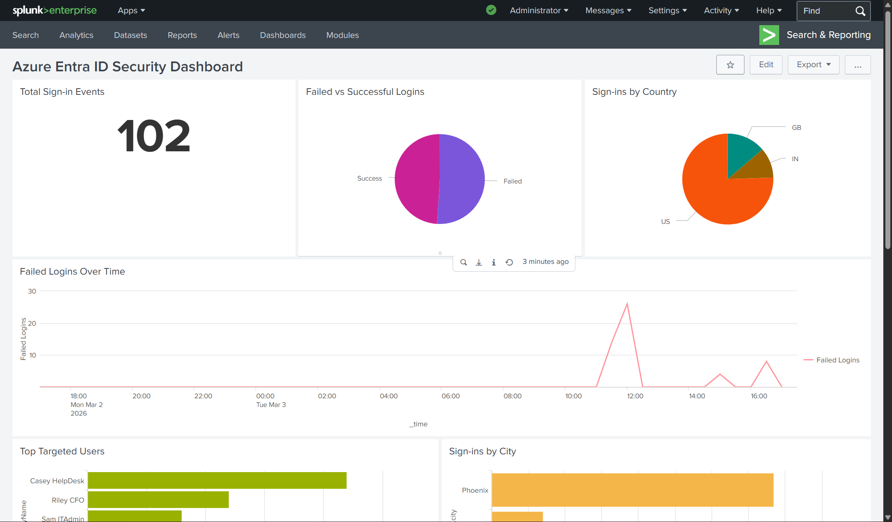

 ## Azure to Splunk SIEM Integration

Azure Entra ID security monitoring with Splunk Enterprise — ingesting sign-in logs via Microsoft Graph API and detecting identity-based threats using SPL detection rules.



---

## 🎯 Project Overview

This project demonstrates cloud-to-SIEM integration by connecting Microsoft Azure Entra ID to Splunk Enterprise for real-time security monitoring and threat detection.

### Architecture

```
┌─────────────────────┐         ┌─────────────────────┐
│   Microsoft Azure   │         │  Splunk Enterprise  │
│                     │         │                     │
│  ┌───────────────┐  │         │  ┌───────────────┐  │
│  │   Entra ID    │  │  Graph  │  │   Add-on for  │  │
│  │  Sign-in Logs │──┼───API───┼─▶│  Microsoft    │  │
│  │               │  │         │  │  Office 365   │  │
│  └───────────────┘  │         │  └───────────────┘  │
│                     │         │         │           │
│  ┌───────────────┐  │         │         ▼           │
│  │     App       │  │         │  ┌───────────────┐  │
│  │ Registration  │  │         │  │  SPL Detection│  │
│  │ (OAuth 2.0)   │  │         │  │  Rules (13)   │  │
│  └───────────────┘  │         │  └───────────────┘  │
│                     │         │         │           │
└─────────────────────┘         │         ▼           │
                                │  ┌───────────────┐  │
                                │  │   Security    │  │
                                │  │   Dashboard   │  │
                                │  └───────────────┘  │
                                └─────────────────────┘
```

---

## 🛡️ Detection Rules (13 Total)

| # | Detection | MITRE ATT&CK | Description |
|---|-----------|--------------|-------------|
| 1 | Failed Logins | T1110 | All failed authentication attempts |
| 2 | Brute Force | T1110 | Multiple failures per user/IP |
| 3 | Brute Force → Success | T1110 | Failures followed by successful login |
| 4 | Login Summary by User | T1078 | Success/failure breakdown per user |
| 5 | Logins by Location | T1078 | Geographic distribution of logins |
| 6 | MFA Blocked | T1111 | MFA enforcement events |
| 7 | Conditional Access Failures | T1078 | CA policy blocks |
| 8 | Impossible Travel | T1078 | Logins from multiple countries |
| 9 | Risky Sign-ins | T1078 | Azure risk detection alerts |
| 10 | Multiple IPs per User | T1078 | Single user, multiple IP addresses |
| 11 | Client App Analysis | T1078 | Legacy/risky client applications |
| 12 | Logins by Application | T1078 | Application usage patterns |
| 13 | Failed Logins by Location | T1110 | Geographic sources of attacks |

---

## 📊 Dashboard

Security monitoring dashboard with 10 visualizations:

| Panel | Visualization | Purpose |
|-------|---------------|---------|
| Total Sign-ins | Single Value | Overall activity volume |
| Failed vs Success | Pie Chart | Authentication success rate |
| Failed Logins Over Time | Line Chart | Attack trend analysis |
| Top Targeted Users | Bar Chart | Most attacked accounts |
| Sign-ins by Country | Pie Chart | Geographic distribution |
| Sign-ins by City | Bar Chart | Location breakdown |
| Brute Force Attempts | Table | Active attack detection |
| MFA Blocks | Table | MFA enforcement events |
| Impossible Travel | Table | Geographic anomalies |
| CA Failures | Table | Policy violations |

---

## 🔄 KQL vs SPL Comparison

Demonstrating multi-SIEM expertise with both Microsoft Sentinel and Splunk:

| Operation | KQL (Sentinel) | SPL (Splunk) |
|-----------|----------------|--------------|
| Filter failures | `where ResultType != 0` | `where 'status.errorCode' != 0` |
| Count by user | `summarize count() by User` | `stats count by userPrincipalName` |
| Time filter | `where TimeGenerated > ago(1h)` | `earliest=-1h` |
| Distinct count | `dcount(IPAddress)` | `dc(ipAddress)` |
| Multiple values | `make_set(Location)` | `values(location.city)` |
| Parse JSON | `extend data = parse_json(col)` | `spath fieldname` |

---

## 🛠️ Setup Guide

### Prerequisites

- Splunk Enterprise (free license: 500MB/day)
- Azure subscription with Entra ID
- Global Administrator or Security Reader role

### Step 1: Azure App Registration

1. Azure Portal → Microsoft Entra ID → App registrations
2. Click **New registration**
   - Name: `Splunk-Log-Collector`
   - Supported account types: Single tenant
3. Click **Register**
4. Note the **Application (client) ID** and **Directory (tenant) ID**

### Step 2: Create Client Secret

1. In App Registration → **Certificates & secrets**
2. Click **New client secret**
   - Description: `Splunk-Secret`
   - Expires: 24 months
3. Click **Add**
4. **Copy the Value immediately** (shown only once)

### Step 3: Grant API Permissions

1. In App Registration → **API permissions**
2. Click **Add a permission**
3. Select **Microsoft Graph** → **Application permissions**
4. Add:
   - `AuditLog.Read.All`
   - `Directory.Read.All`
5. Click **Add a permission** again
6. Select **APIs my organization uses** → Search **Office 365 Management APIs**
7. Select **Application permissions** → Add:
   - `ActivityFeed.Read`
8. Click **Grant admin consent** → **Yes**

### Step 4: Install Splunk Add-on

1. Splunk Web → **Apps** → **Find More Apps**
2. Search: `Splunk Add-on for Microsoft Office 365`
3. Install and restart Splunk

### Step 5: Configure Tenant

1. Add-on → **Configuration** → **Add Tenant**
2. Enter:
   - Name: `azure-entra-logs`
   - Endpoint: `Worldwide`
   - Tenant ID: (from Azure)
   - Client ID: (from Azure)
   - Client Secret: (from Azure)

### Step 6: Create Input

1. Add-on → **Inputs** → **Create New Input**
2. Select **Audit Logs**
3. Configure:
   - Name: `azure_audit_logs`
   - Tenant: `azure-entra-logs`
   - Content Type: `Audit Logs.Sign Ins`
   - Index: `azure_logs`
4. Save

### Step 7: Create Index

1. Settings → **Indexes** → **New Index**
2. Index Name: `azure_logs`
3. Save

### Step 8: Verify Data

Wait 15-30 minutes, then run:

```spl
index=azure_logs
| stats count by sourcetype
```

## 🚀 Skills Demonstrated

| Category | Skills |
|----------|--------|
| **SIEM** | Splunk Enterprise, SPL queries, Dashboard creation |
| **Cloud** | Azure Entra ID, App Registration, Microsoft Graph API |
| **Security** | Detection engineering, MITRE ATT&CK mapping |
| **Integration** | OAuth 2.0, API authentication, Log ingestion |

---

## 📜 Related Certifications

| Certification | Skills Applied |
|---------------|----------------|
| SC-300 | Identity protection, Entra ID, Conditional Access |
| SC-100 | Security architecture, SIEM integration |
| AZ-900 | Azure services, App Registration |

---

## 👤 Author

**Amogh Karankal**

- LinkedIn: [linkedin.com/in/amoghkarankal](https://linkedin.com/in/amoghkarankal)
- GitHub: [github.com/Amogh-Karankal](https://github.com/Amogh-Karankal)

---

## 📄 License

MIT License
